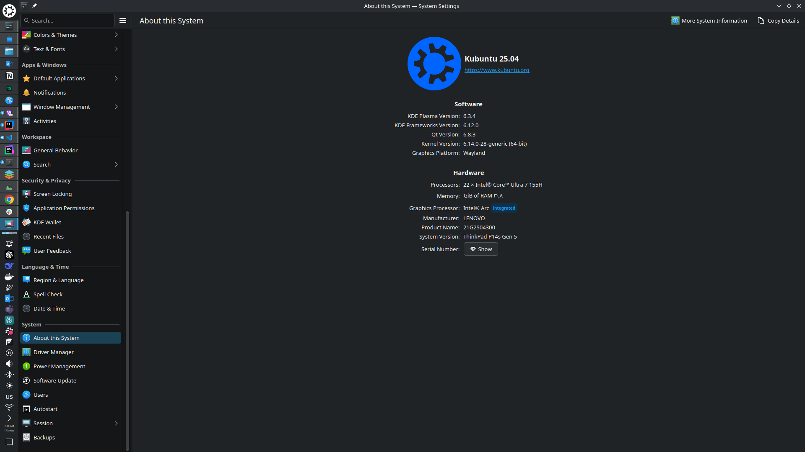

# My Kubuntu Setup - ThinkPad P14s Gen 5

I switched from Windows + WSL to Kubuntu and never looked back. This is my daily coding machine - fast, reliable, and actually works. No more waiting 2 minutes for npm install or dealing with broken file watching. Just pure productivity on Linux.

If you're tired of WSL being slow and buggy, this guide shows you exactly how to set up a proper Linux dev environment that just works.

## Table of Contents

- [My Setup in Action](#my-setup-in-action)
- [How to Install Kubuntu](#how-to-install-kubuntu)
- [Why I Quit Windows + WSL](#why-i-quit-windows--wsl)
- [Why Kubuntu is Better](#why-kubuntu-is-better)
- [What I Use](#what-i-use)
- [How to Set Everything Up](#how-to-set-everything-up)
  - [Quick Install Guide](#quick-install-guide)
  - [Development Tools](#development-tools)
  - [Terminal Setup](#terminal-setup)
  - [Apps Installation](#apps-installation)
  - [CLI Tools](#cli-tools)
- [Speed Difference](#speed-difference)
- [Helpful Links](#helpful-links)
- [My Advice](#my-advice)

## My Setup in Action

<i>My daily driver - Kubuntu 25.04 with KDE Plasma</i>

<i>Clean and minimal KDE desktop - fast and responsive</i>

<i>Konsole terminal - where the magic happens</i>

<i>Ram & CPU utlization (better than WSL :D)</i>

<i>KDE System Monitor - tracking CPU, memory, and network usage</i>

## How to Install Kubuntu

Download the ISO from [kubuntu.org](https://kubuntu.org/getkubuntu/), flash it to a USB with [Rufus](https://rufus.ie/), boot from USB, and install. Takes 20 minutes. [Here's a video guide](https://hive.blog/linux/@ribalinux/how-to-install-kubuntu-24-04-lts) if you need help.

Try it in live mode first. If you like it, install it. If not, just restart.

## Why I Quit Windows + WSL

I used WSL since version 1. Stuck with it for years. Even had a laptop with 32GB RAM and fast CPU. Didn't matter. WSL still sucked.

npm install took 2 minutes. Now it takes 30 seconds. Docker was slow as hell. File watching didn't work half the time. WSL ate 8-10GB of RAM doing nothing. It crashed all the time. Lost my work multiple times. VPNs broke it. File permissions were a mess.

WSL sucks. Period.

## Why Kubuntu is Better

Kubuntu is amazing for coding. Everything just works. Boots in 15 seconds. Battery lasts 7 hours instead of 4. Uses only 1GB RAM when idle.

Docker runs native - no VM crap. Hot reload actually works. Git is super fast. No crashes. No permission problems. This is how coding should be.

## What I Use

I code in VS Code. Use Docker for containers. nvm for Node versions. pyenv for Python versions. PostgreSQL and Redis for databases.

Terminal is Bash with Oh My Bash (or Zsh with Oh My Zsh). Starship prompt shows git info. tmux for multiple terminals.

Apps: Spotify, Telegram, Discord, VLC, OBS.

## How to Set Everything Up

### Quick Install Guide

| What | Command | Why |
|------|---------|-----|
| System Update | `sudo apt update && sudo apt upgrade` | Get latest packages |
| Basic Tools | `sudo apt install build-essential git curl wget vim htop neofetch` | Essential dev tools |

### Development Tools

| Tool | Install Commands | Purpose |
|------|-----------------|---------|
| Docker | `sudo apt install docker.io docker-compose` `sudo usermod -aG docker $USER` `sudo systemctl enable docker` | Containers |
| Node.js | `curl -o- https://raw.githubusercontent.com/nvm-sh/nvm/v0.39.0/install.sh \| bash` Restart terminal `nvm install --lts` | JavaScript |
| Python | `curl https://pyenv.run \| bash` Add to shell config `pyenv install 3.11.5` | Python dev |
| Java | `sudo apt install openjdk-17-jdk` `java -version` | Java dev |
| VS Code | `sudo snap install code --classic` | Code editor |

### Terminal Setup

| Option | Commands | Result |
|--------|----------|--------|
| Bash + Oh My Bash | `bash -c "$(curl -fsSL https://raw.githubusercontent.com/ohmybash/oh-my-bash/master/tools/install.sh)"` | Better Bash |
| Zsh + Oh My Zsh | `sudo apt install zsh` `chsh -s $(which zsh)` `sh -c "$(curl -fsSL https://raw.github.com/ohmyzsh/ohmyzsh/master/tools/install.sh)"` | Better Zsh |
| Starship Prompt | `curl -sS https://starship.rs/install.sh \| sh` Add to `.bashrc` or `.zshrc` | Cool prompt |

### Apps Installation

| Type | Command | Apps |
|------|---------|------|
| Flatpak Setup | `sudo apt install flatpak` `sudo flatpak remote-add --if-not-exists flathub https://flathub.org/repo/flathub.flatpakrepo` | Enable Flatpak |
| Media Apps | `flatpak install flathub com.spotify.Client` `flatpak install flathub org.videolan.VLC` `flatpak install flathub com.obsproject.Studio` | Spotify, VLC, OBS |
| Chat Apps | `flatpak install flathub org.telegram.desktop` `flatpak install flathub com.discordapp.Discord` | Telegram, Discord |
| Work Apps | `sudo snap install postman` `sudo snap install notion-snap-reborn` `flatpak install flathub md.obsidian.Obsidian` | Postman, Notion, Obsidian |

### CLI Tools

| Tool | Install | What it does |
|------|---------|--------------|
| Dev Tools | `sudo apt install tmux postgresql-client redis-tools httpie jq ripgrep` | Terminal tools |
| LazyDocker | `curl https://raw.githubusercontent.com/jesseduffield/lazydocker/master/scripts/install_update_linux.sh \| bash` | Docker UI |
| LazySQL | `go install github.com/jorgerojas26/lazysql@latest` | Database UI |

## Speed Difference

| What | Windows + WSL | Kubuntu |
|------|---------------|---------|
| Boot | 45 seconds | 15 seconds |
| npm install | 2+ minutes | 30 seconds |
| Docker build | 3 minutes | 1 minute |
| RAM (idle) | 4.5 GB | 1.2 GB |
| Battery | 4 hours | 6-7 hours |

## Helpful Links

* [Kubuntu](https://kubuntu.org/) - Official Kubuntu site
* [KDE](https://kde.org/) - KDE Plasma desktop
* [Linux Journey](https://linuxjourney.com/) - Learn Linux basics
* [Arch Wiki](https://wiki.archlinux.org/) - Has answers for everything  
* [Docker Docs](https://docs.docker.com/) - Docker help
* [Ask Ubuntu](https://askubuntu.com/) - Get help
* [r/linux](https://reddit.com/r/linux) - Linux community
* [TLP](https://linrunner.de/tlp/) - Save battery
* [Timeshift](https://github.com/linuxmint/timeshift) - Backup your system

## My Advice

If you're thinking about switching from Windows, just do it. Try dual boot first if you're scared. Give it a month. Things will break sometimes. You'll figure it out. Google helps. Arch Wiki has all answers.

Linux is worth it. No more Windows updates. No more bloat. No more WSL problems. Just a fast computer that works.

---

**Bottom line:** WSL = slow and broken. Linux = fast and works.

Ask me anything!

---

*ThinkPad P14s Gen 5 AMD | Kubuntu 24.04 LTS | Happy coder*